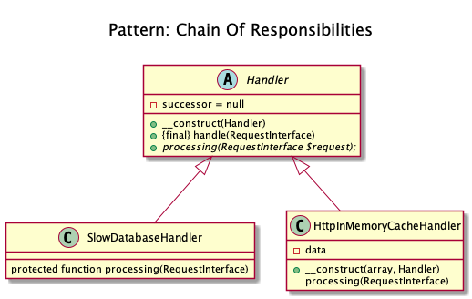
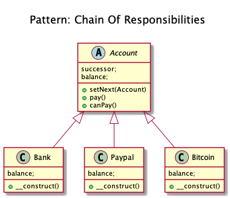

# Chain Of Responsibilities

+ It helps building a chain of objects. Request enters from one end and keeps going from object to object till it finds the suitable handler.

+ It consists of a source of command objects and a series of processing objects. Each processing object contains logic that defines the types of command objects that it can handle. The rest are passed to the next processing object in the chain.

+ Kamran Ahmed example:
	+ You have three payment methods (A, B and C) setup in your account; 
	+ Each having a different amount in it. A has 100 USD, B has 300 USD and C having 1000 USD.
	+ The preference for payments is chosen as A then B then C. 
	+ You try to purchase something that is worth 210 USD. 
	+ Here A, B and C are links of the chain and the whole phenomenon is Chain of Responsibility.

<!-- 
## Recipe
+ Create a class 
-->

## Diagrams
### Dominik Liebler

### Kamran Ahmed

## Sources
+ [Kamran Ahmed](https://github.com/kamranahmedse/design-patterns-for-humans#-chain-of-responsibility)
+ [Domnikl](https://github.com/domnikl/DesignPatternsPHP/tree/master/Behavioral/ChainOfResponsibilities)

