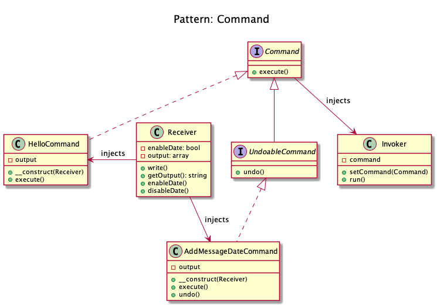

# Command

+ It **encapsulates the invocation and decouples**.

+ We have an **Invoker** and a **Receiver**. 
    + This pattern uses a "Command" to **delegate the method call against the Receiver** and presents the same method "execute" to Invoker. 
    + The Invoker just knows to **call "execute" to process the Command** of the client. 
    + The **Receiver is decoupled from the Invoker**.
+ The second aspect of this pattern is **the undo()**, which undoes the method execute(). 
+ Command can also **be aggregated to combine more complex commands** with minimum copy-paste and be used to implement a **transaction based system**, where you keep maintaining the **history of commands** as soon as you execute them. 
    + If the final command is successfully executed, all good otherwise just iterate through the history and keep executing the **undo on all the executed commands**.

+ Ordering food at a restaurant: You (Client) ask the waiter (Invoker) to bring some food (Command) and waiter simply forwards the request to Chef (Receiver) who has the knowledge of what and how to cook. 
+ Switching the channel on TV: You (Client) switching on (Command) the television (Receiver) using a remote control (Invoker).

+ Allows you to encapsulate actions in objects, in other words to decouple client from receiver.

## From the Domnikl code
+ The concrete command calls "print" on the Receiver, but an external invoker just knows that it can call "execute"
+ Each concrete command is built with different receivers.
+ There can be one, many or completely no receivers, but there can be other commands in the parameters
+ The AddMessageDateCommand *concrete command( tweaks receiver to add current date to messages

## From the KamranAhmed code
+ First of all we have the receiver that has the implementation of every action that could be performed.
+ Then we have an interface that each of the commands are going to implement and then we have a set of commands.
+ Then we have an Invoker with whom the client will interact to process any commands.
+ **Bulb** (Receiver), **TurnOn and TurnOff** (Commands) and **RemoteControl** (Invoker).

## Examples
+ A text editor : all events are Command which can be undone, stacked and saved.
+ Symfony2: SF2 Commands that can be run from the CLI are built with just the Command pattern in mind.
+ big CLI tools use subcommands to distribute various tasks and pack them in "modules", each of these can be implemented with the Command pattern (e.g. vagrant).

## Recipe
+ Create an interface (Command) with a method execute().
+ Create another interface (UndoableCommand) that extends Command with a method undo().
+ Create a class for each command that implements Command (or UndoableCommand) and injects Receiver. It has a property output.
+ Create a class (Receiver) that is responsible for implements functionalities that will be used for undo. Receiver has the knowledge of what and how to cook. 
+ Create a class (Invoker) that receives the commands and runs them, forwards the request to Receiver.

## Sources
+ [Kamran Ahmed](https://github.com/kamranahmedse/design-patterns-for-humans#-command)
+ [Domnikl](https://github.com/domnikl/DesignPatternsPHP/tree/master/Behavioral/Command)
