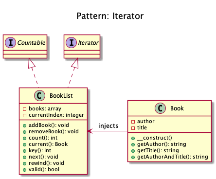
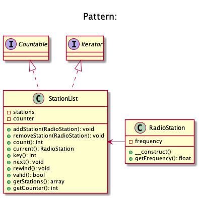

# Iterator

+ It creates an **object iterable** and to make it appear **like a collection of objects**.

+ **Example:** Process a file line by line by just running over all lines (which have an object representation) for a file (which of course is an object, too)

+ **Standard PHP Library (SPL)** defines an interface Iterator which is best suited for this.

## Methods

+ count(): int
+ current(): object
+ key(): int
+ next()
+ rewind()
+ valid(): bool

<!-- 

Iterator
Real world example

An old radio set will be a good example of iterator, where user could start at some channel and then use next or previous buttons to go through the respective channels. Or take an example of MP3 player or a TV set where you could press the next and previous buttons to go through the consecutive channels or in other words they all provide an interface to iterate through the respective channels, songs or radio stations.

In plain words

It presents a way to access the elements of an object without exposing the underlying presentation.

Wikipedia says

In object-oriented programming, the iterator pattern is a design pattern in which an iterator is used to traverse a container and access the container's elements. The iterator pattern decouples algorithms from containers; in some cases, algorithms are necessarily container-specific and thus cannot be decoupled.

Programmatic example

In PHP it is quite easy to implement using SPL (Standard PHP Library). Translating our radio stations example from above. First of all we have RadioStation

Then we have our iterator

And then it can be used as

$stationList = new StationList();

$stationList->addStation(new RadioStation(89));
$stationList->addStation(new RadioStation(101));
$stationList->addStation(new RadioStation(102));
$stationList->addStation(new RadioStation(103.2));

foreach($stationList as $station) {
    echo $station->getFrequency() . PHP_EOL;
}

$stationList->removeStation(new RadioStation(89)); // Will remove station 89

--> 
## Recipe
+ Create a class 

## Diagrams
### Dominik Liebler

### Kamran Ahmed

# Sources
+ [Kamran Ahmed](https://github.com/kamranahmedse/design-patterns-for-humans#-iterator)
+ [Domnikl](https://github.com/domnikl/DesignPatternsPHP/tree/master/Behavioral/Iterator)
