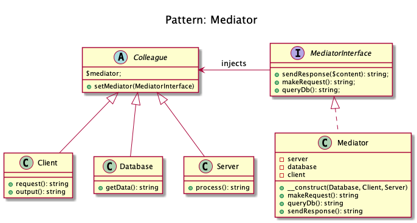

# Mediator

+ An easy way to decouple many components working together. 

+ It is a **good alternative to Observer IF you have a "central intelligence"**, like a controller.

+ **All components _(called Colleague)_ are only coupled to the MediatorInterface**. This is the key-feature of this pattern.

+ **Examples:**   
	+ When you talk to someone on your mobile phone, there is a network provider sitting between you and them and your conversation goes through it instead of being directly sent. In this case network provider is mediator.

	+ Mediator pattern adds a third party object (called mediator) to control the interaction between two objects (called colleagues). It helps reduce the coupling between the classes communicating with each other.  Because now they don't need to have the knowledge of each other's implementation.

	+ The mediator pattern defines an object that encapsulates how a set of objects interact. It is considered a behavioral pattern due to the way it can alter the program's running behavior.

+ Domnikl Example: 
	+ Client is a client that makes requests and gets the response.
	+ This interface is not mandatory but it is better for Liskov substitution principle concerns.
	+ Colleague is an abstract colleague who works together but he only knows the Mediator, not other colleagues

+ Kamran Ahmed example: Chat room (mediator) with users (colleagues) sending messages to each other.

## Recipe
+ Create a class 

## Sources
+ [Kamran Ahmed](https://github.com/kamranahmedse/design-patterns-for-humans#-mediator)
+ [Domnikl](https://github.com/domnikl/DesignPatternsPHP/tree/master/Behavioral/Mediator)

