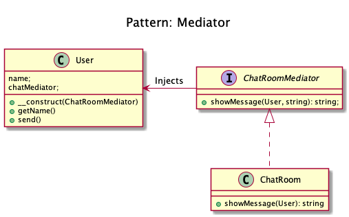

# Mediator

This pattern provides an easy way to decouple many components working
together. It is a good alternative to Observer IF you have a "central
intelligence", like a controller (but not in the sense of the MVC).

All components (called Colleague) are only coupled to the
MediatorInterface and it is a good thing because in OOP, one good friend
is better than many. This is the key-feature of this pattern.
  
<!-- 
Mediator
Real world example

A general example would be when you talk to someone on your mobile phone, there is a network provider sitting between you and them and your conversation goes through it instead of being directly sent. In this case network provider is mediator.

In plain words

Mediator pattern adds a third party object (called mediator) to control the interaction between two objects (called colleagues). It helps reduce the coupling between the classes communicating with each other. Because now they don't need to have the knowledge of each other's implementation.

Wikipedia says

In software engineering, the mediator pattern defines an object that encapsulates how a set of objects interact. This pattern is considered to be a behavioral pattern due to the way it can alter the program's running behavior.

Programmatic Example

Here is the simplest example of a chat room (i.e. mediator) with users (i.e. colleagues) sending messages to each other.

First of all, we have the mediator i.e. the chat room

// Mediator

Then we have our users i.e. colleagues

And the usage

$mediator = new ChatRoom();

$john = new User('John Doe', $mediator);
$jane = new User('Jane Doe', $mediator);

$john->send('Hi there!');
$jane->send('Hey!');

// Output will be
// Feb 14, 10:58 [John]: Hi there!
// Feb 14, 10:58 [Jane]: Hey!

--> 

## Recipe
+ Create a class 

## Sources
+ [Kamran Ahmed](https://github.com/kamranahmedse/design-patterns-for-humans#-mediator)
+ [Domnikl](https://github.com/domnikl/DesignPatternsPHP/tree/master/Behavioral/Mediator)

