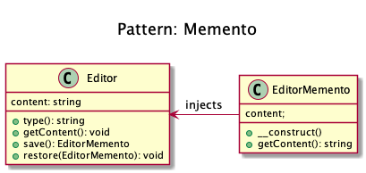
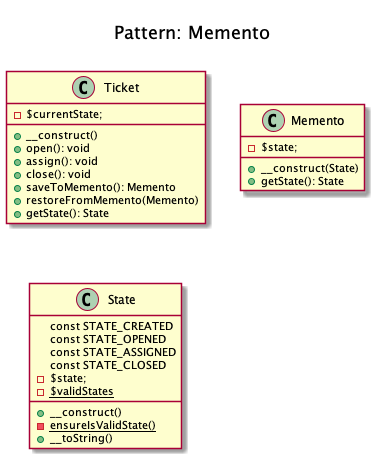

# Memento

+ Memento pattern is about **capturing and storing the current state of an object** in a manner that **it can be restored later** (undo via rollback).

+ It provides the ability to **restore an object to it's previous state** or to **gain access to state of the object, without revealing it's implementation** (the object is not required to have a function to return the current state).

+ The memento pattern is implemented with three objects: 
	+ The **Originator**: performs some actions. 
	+ The **Caretaker**: controls the states history.
	+ The **Memento**: holds the object's state.

+ Memento is an object that *contains a concrete unique snapshot of state* of any object or resource: string, number, array, an instance of class and so on.

+ The uniqueness in this case does not imply the prohibition existence of similar states in different snapshots. That means the state can be extracted as the independent clone.
 
+ Any object stored in the Memento should be *a full copy of the original object rather than a reference* to the original object. The Memento object is a "opaque object" (the object that no one can or should change).

+ **Originator:**
	+ It contains the *actual state of an external object is strictly specified type*. 
	+ It is able to create a unique copy of this state and return it wrapped in a Memento. 
	+ It does not know the history of changes. 
	+ You can set a concrete state to Originator from the outside, which will be considered as actual. 
	+ It must make sure that given state corresponds the allowed type of object. 
	+ It may (but not should) have any methods, but *they can't make changes to the saved object state*.

+ Caretaker: 
	+ It *controls the states history*. 
	+ It may make changes to an object;
	+ take a decision to save the state of an external object in the Originator;
	+ ask from the Originator snapshot of the current state; or set the Originator state to equivalence with some snapshot from history.

+ **Kamran Ahmed example:**
	+ The text editor which keeps saving the state from time to time and that you can restore if you want.
	+ The memento object that will be able to hold the editor state.
	+ The editor (originator) that is going to use memento object.

+ **Examples:**
	+ **Calculator _(originator)_**, where whenever you perform some calculation the last calculation is **saved in memory _(memento)_** so that you can get back to it and maybe get it restored using some action buttons (caretaker).

## Recipe
<!--
+ Create a class
-->

## Sources
+ [Kamran Ahmed](https://github.com/kamranahmedse/design-patterns-for-humans#-memento)
+ [Domnikl](https://github.com/domnikl/DesignPatternsPHP/tree/master/Behavioral/Memento)

