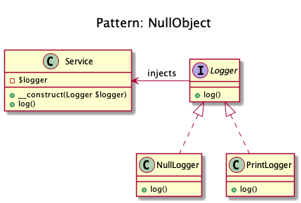

# Null Object
 
+ NullObject **is not a GoF design pattern** but a schema which appears
 frequently enough to be considered a pattern. 
+ Methods that return an object or null should instead **return an object or NullObject**.
+ NullObject simplify boilerplate code such as **if (!is_null($obj)) { $obj->callSomething(); }** to just **$obj->callSomething();** by eliminating the conditional check in client code.

## Benefits:
 
+  Client code is simplified.
+  Reduces the chance of null pointer exceptions.
+  Fewer conditionals, require less test cases.

 
## Examples 
+  Symfony2: null logger of profiler.
+  Symfony2: null output in Symfony/Console.
+  null handler in a Chain of Responsibilities pattern.
+  null command in a Command pattern.
  
  
## Recipe  
+ Create Interface and implement it in all loggers.
+ Create the Class NullLogger.
+ Inject the Interface in main Service
+ You don't have to check if the logger is set with is_null(), instead just use it.

## Sources
+ [Domnikl](https://github.com/domnikl/DesignPatternsPHP/tree/master/Behavioral/NullObject)
