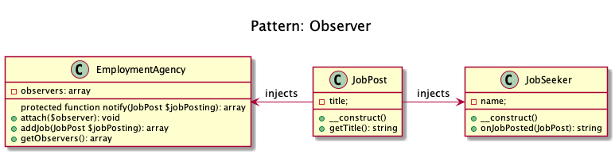

# Observer

+ An object, called the **subject, maintains a list of its dependents (observers)**, and **notifies them automatically of any state changes**, usually by calling one of their methods.

+ To implement a **publish/subscribe behaviour** to an object, **whenever a "Subject" object changes its state**, the attached "Observers" will be notified. 

+ PHP already defines two interfaces that can help to implement this pattern: **SplObserver and SplSubject**.

## Entities
+ Subject
+ Observer

## Examples
+ The **job seekers where they subscribe to some job posting site** and they are notified whenever there is a matching job opportunity.
+ A **message queue system** is observed to show the progress of a job in a GUI.

## Recipe
+ Create a class that implements SplObserver with a private property called changed and the getChanged().
+ This class has to implement the method: update().
+ Create a class that implements SplSubject with a private property called observers.
+ The SplObjectStorage is injected by construcotr.
+ This class has to implement the methods: attach(), detach() and notify().
+ Every command method has to call notify() to inform the change.
+ Every change notified the subject is updated (cloned and returned).

## Sources
+ [Domnikl](https://github.com/domnikl/DesignPatternsPHP/tree/master/Behavioral/Observer)
+ [Kamran Ahmed](https://github.com/kamranahmedse/design-patterns-for-humans#-observer)

