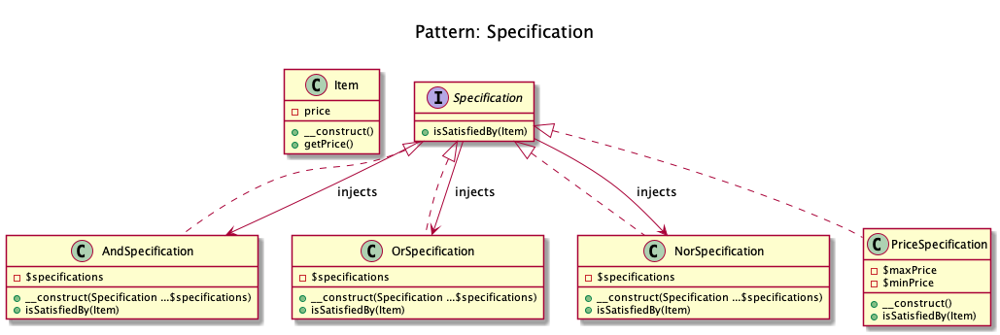

# Specification

+ It builds a clear **specification of business rules, where objects can be checked against**. 

  
## Recipe
+ Create the Specification Interface and implement it in all Specifications classes.
+ Create the Specifications classes And, Or, Nor and any other rules.
+ The Specification classes have one method **isSatisfiedBy()** that returns either true or false depending on whether
  the given object satisfies the specification.
+ Create the Item class that will be injects in every isSatisfiedBy() method.

## Diagrams
### Dominik Liebler

## Sources
+ [Domnikl](https://github.com/domnikl/DesignPatternsPHP/tree/master/Behavioral/Specification)
