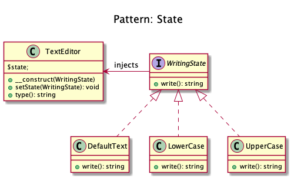
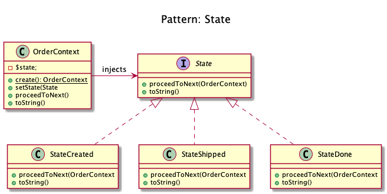

# State

+ Encapsulate varying behavior for the same routine based on an object's state. 

+ This can be a cleaner way for an object to change its behavior at runtime without resorting to large monolithic conditional statements.

+ Imagine you are using some drawing application, you choose the paint brush to draw. Now the brush changes its behavior based on the selected color. if you have chosen red color it will draw in red, if blue then it will be in blue.

+ It lets you change the behavior of a class when the state changes.

+ It creates a state machine by implementing each individual state as a derived class of the state pattern interface, and implementing state transitions by invoking methods defined by the pattern's superclass. 

+ The state pattern can be interpreted as a strategy pattern which is able to switch the current strategy through invocations of methods defined in the pattern's interface.

+ Kamran Ahmed example:
	+ The Text editor lets you change the state of text that is typed. If you have selected bold, it starts writing in bold, if italic then in italics and etc.

<!-- 
## Recipe
+ Create a class 
--> 

## Sources
+ [Kamran Ahmed](https://github.com/kamranahmedse/design-patterns-for-humans#-state)
+ [Domnikl](https://github.com/domnikl/DesignPatternsPHP/tree/master/Behavioral/State)

