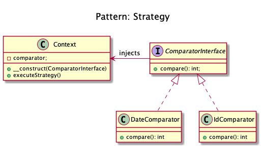
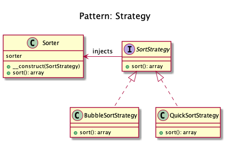

# Strategy

+ It separates strategies and enables fast switching between them. 

+ This pattern is a good alternative to inheritance (instead of having an abstract class that is extended).

+ Strategy pattern allows you to switch the algorithm or strategy based upon the situation.

+ The strategy pattern (aka policy pattern) enables an algorithm's behavior to be selected at runtime.

+ Domnikl Example:
	+ Sorting a list of objects, one strategy by date and the other by id.
	+ Switching between file and in-memory storage

+ Kamran Ahmed example:
	+ Consider the example of sorting, we implemented Asc sort but the data started to grow and Asc sort started getting very slow. 
	In order to tackle this we implemented Desc sort. But now although the Desc sort algorithm was doing better for large datasets, it was very slow for smaller datasets. 
	In order to handle this we implemented a strategy where for small datasets, Asc sort will be used and for larger, Desc sort.
	+ First of all we have our strategy interface and different strategy implementations
	+ And then we have our client that is going to use any strategy.

<!-- 
## Recipe
+ Create a class 
--> 

## Diagrams
### Dominik Liebler

### Kamran Ahmed

## Sources
+ [Kamran Ahmed](https://github.com/kamranahmedse/design-patterns-for-humans#-strategy)
+ [Domnikl](https://github.com/domnikl/DesignPatternsPHP/tree/master/Behavioral/Strategy)

