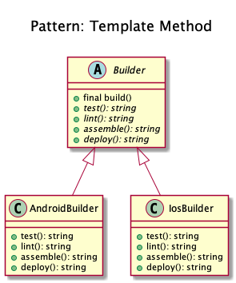
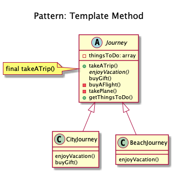

# Template Method

+ It defines the skeleton of how a certain algorithm could be performed (abstract class), but defers the implementation of those steps to the children classes.

+ The idea is to let subclasses of this abstract template "finish" the behavior of an algorithm.

+ A.k.a the "Hollywood principle": "Don't call us, we call you." 

+ This class is not called by subclasses but the inverse. How? With abstraction of course.

+ The user has just to implement one method and the superclass do the job.

+ It is an easy way to decouple concrete classes and reduce copy-paste.

+ Suppose we are getting some house built. The steps for building might look like
	+ Prepare the base of house
	+ Build the walls
	+ Add roof
	+ Add other floors
	
	The order of these steps could never be changed. 
	You can't build the roof before building the walls etc but each of the steps could be modified for example walls can be made of wood or polyester or stone.
 	It lets one redefine certain steps of an algorithm without changing the algorithm's structure.

<!--
Imagine we have a build tool that helps us test, lint, build, generate build reports (i.e. code coverage reports, linting report etc) and deploy our app on the test server.

First of all we have our base class that specifies the skeleton for the build algorithm

Then we can have our implementations

And then it can be used as

## Recipe
+ Create a class 
-->

## Sources
+ [Kamran Ahmed](https://github.com/kamranahmedse/design-patterns-for-humans#-template-method)
+ [Domnikl](https://github.com/domnikl/DesignPatternsPHP/tree/master/Behavioral/TemplateMethod)

