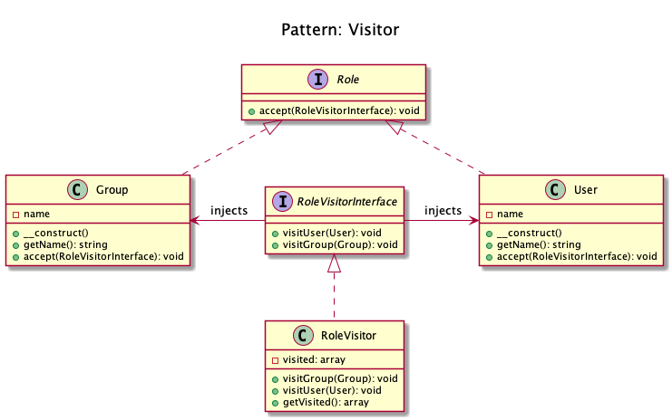

# Visitor

+ To **outsource operations on objects to other objects**. The main reason to do this is to keep a **separation of concerns**.
+ Visitor pattern lets you add further operations to objects without having to modify them.
+ The classes have to define a **contract to allow visitors** (**Role::accept()**).
+ Each Visitor has to **choose itself which method to invoke on the visitor**.  
+ The visitor design pattern is a **way of separating an algorithm from an object structure on which it operates**. 
A practical result of this separation is the **ability to add new operations to existing object structures without modifying those structures**. 
It is one way to follow the **open/closed principle**.

## Case
+ Consider someone visiting Dubai. They just need a visa to enter Dubai. After arrival, they can come and visit any place in Dubai on their own without having to ask for permission or to do some leg work in order to visit any place here, just let them know of a place and they can visit it. 
    + The Visitor pattern helps you **add places to visit** so that they can visit as much as they can without having to do any leg work.

## Recipe
+ Create an interface (Role) with the method accept(), inject the interface RoleVisitorInterface in constructor.
+ Create an interface (RoleVisitorInterface) with the two methods visitUser() and visitGroup(), inject the objects User and Gropu respectively.
    + The visitor must not choose itself which method to invoke _(the Visitee makes this decision)_.
+ For each Role: create a class that implements Role.
+ For each RoleVisitor: create a class that implements RoleVisitorInterface.

## Sources
+ [Kamran Ahmed](https://github.com/kamranahmedse/design-patterns-for-humans#-visitor)
+ [Domnikl](https://github.com/domnikl/DesignPatternsPHP/tree/master/Behavioral/Visitor)
