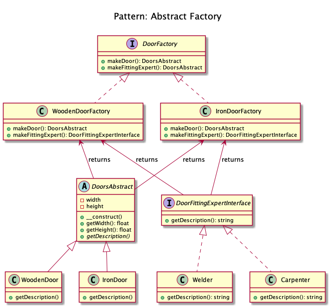
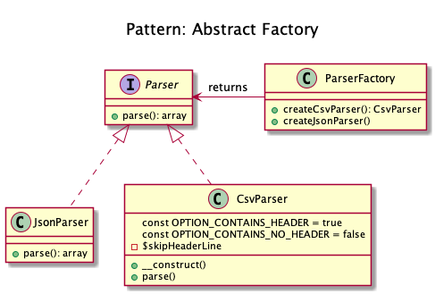

# Abstract Factory
 
+ To create series of related or dependent objects without specifying their concrete classes. 
Usually the created classes all implement the same interface. 
The client of the abstract factory does not care about how these objects are created, it just knows how they go together.
 
<!--
Extending our door example from Simple Factory. 
Based on your needs you might get a wooden door from a wooden door shop, iron door from an iron shop or a PVC door from the relevant shop. 
Plus you might need a guy with different kind of specialities to fit the door, for example a carpenter for wooden door, welder for iron door etc. 
As you can see there is a dependency between the doors now, wooden door needs carpenter, iron door needs a welder etc.

A factory of factories; a factory that groups the individual but related/dependent factories together without specifying their concrete classes.

The abstract factory pattern provides a way to encapsulate a group of individual factories that have a common theme without specifying their concrete classes

Translating the door example above. First of all we have our Door interface and some implementation for it

interface Door {
    public function getDescription();
}

class WoodenDoor implements Door {
    public function getDescription() {
        echo 'I am a wooden door';
    }
}

class IronDoor implements Door {
    public function getDescription() {
        echo 'I am an iron door';
    }
}
Then we have some fitting experts for each door type

Now we have our abstract factory that would let us make family of related objects i.e. wooden door factory would create a wooden door and wooden door fitting expert and iron door factory would create an iron door and iron door fitting expert

// Wooden factory to return carpenter and wooden door

// Iron door factory to get iron door and the relevant fitting expert

And then it can be used as

$woodenFactory = new WoodenDoorFactory();

$door = $woodenFactory->makeDoor();
$expert = $woodenFactory->makeFittingExpert();

$door->getDescription();  // Output: I am a wooden door
$expert->getDescription(); // Output: I can only fit wooden doors

// Same for Iron Factory
$ironFactory = new IronDoorFactory();

$door = $ironFactory->makeDoor();
$expert = $ironFactory->makeFittingExpert();

$door->getDescription();  // Output: I am an iron door
$expert->getDescription(); // Output: I can only fit iron doors
As you can see the wooden door factory has encapsulated the carpenter and the wooden door also iron door factory has encapsulated the iron door and welder. And thus it had helped us make sure that for each of the created door, we do not get a wrong fitting expert.

When to use?

When there are interrelated dependencies with not-that-simple creation logic involved

-->  

## Recipe
+ Create a class 

## Sources
+ [Kamran Ahmed](https://github.com/kamranahmedse/design-patterns-for-humans#-abstract-factory)
+ [Domnikl](https://github.com/domnikl/DesignPatternsPHP/tree/master/Creational/AbstractFactory)
