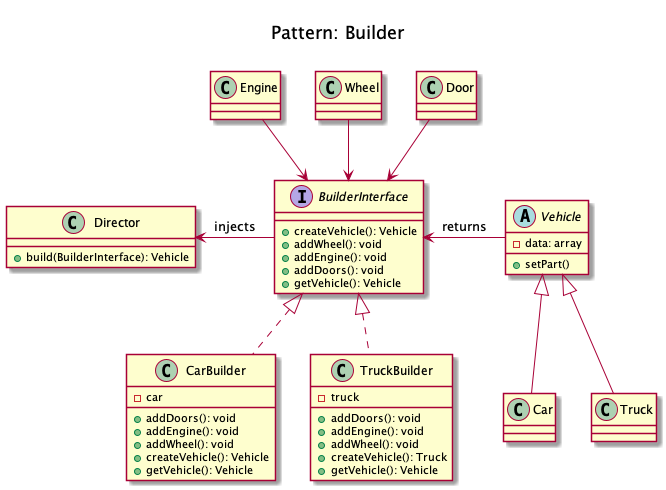
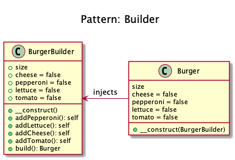

# Builder

+ It creates different flavors of an object while avoiding constructor pollution. 
	Useful when there could be several flavors of an object. 
	Or when there are a lot of steps involved in creation of an object.

+ It is an interface that build parts of a complex object.

+ If the builder has a better knowledge of what it builds, this interface could be an abstract class with default methods (aka adapter).

+ If you have a complex inheritance tree for objects, it is logical to have a complex inheritance tree for builders too.

+ Builders have often a fluent interface, see the mock builder of PHPUnit for example.

+ You can also inject many builders instead of one to build more complex objects
 
+ Example
	+ Imagine you are at Hardee's and you order a specific deal, lets say, "Big Hardee" and they hand it over to you without any questions; 
	this is the example of simple factory. 
	But there are cases when the creation logic might involve more steps. 
	For example you want a customized Subway deal, you have several options in how your burger is made e.g what bread do you want? 
	what types of sauces would you like? 
	What cheese would you want? etc. 
	In such cases builder pattern comes to the rescue.

+ Use Builder instead of telescoping constructor anti-pattern.

```
# telescoping constructor anti-pattern
public function __construct($size, $cheese = true, $pepperoni = true, $tomato = false, $lettuce = true) { }
```

+ The key difference from the factory pattern is that factory pattern is to be used when the creation is a one step process while builder pattern is a multi step process.

<!--
## Recipe
+ Create a class 
-->

## Diagrams
### Dominik Liebler


### Kamran Ahmed



## Sources
+ [Kamran Ahmed](https://github.com/kamranahmedse/design-patterns-for-humans#-builder)
+ [Domnikl](https://github.com/domnikl/DesignPatternsPHP/tree/master/Creational/Builder)