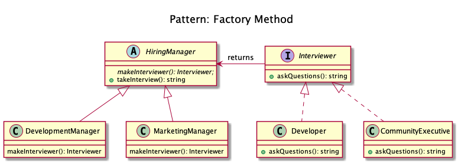
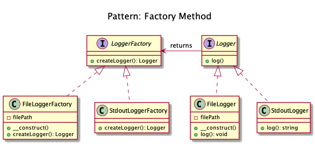

# Factory Method

+ It provides a way to delegate the instantiation logic to child classes.
	
+ Different of SimpleFactory, it is you can subclass it to implement different ways to create objects.

+ It implements the Dependency Inversion principle (SOLID). It means the FactoryMethod class depends on abstractions, not concrete classes. 

For simple cases, this abstract class could be just an interface.

+ Kamran Ahmed example: 
	+ Consider the case of a hiring manager. It is impossible for one person to interview for each of the positions. Based on the job opening, she has to decide and delegate the interview steps to different people.

Uses factory methods to deal with the problem of creating objects without having to specify the exact class of the object that will be created. 

This is done by creating objects by calling a factory method—either specified in an interface and implemented by child classes, or implemented in a base class and optionally overridden by derived classes—rather than by calling a constructor.

<!-- 
Programmatic Example

Taking our hiring manager example above. First of all we have an interviewer interface and some implementations for it
Now let us create our HiringManager
Now any child can extend it and provide the required interviewer
and then it can be used as

$devManager = new DevelopmentManager();
$devManager->takeInterview(); // Output: Asking about design patterns

$marketingManager = new MarketingManager();
$marketingManager->takeInterview(); // Output: Asking about community building.
When to use?

Useful when there is some generic processing in a class but the required sub-class is dynamically decided at runtime. Or putting it in other words, when the client doesn't know what exact sub-class it might need.

## Recipe
+ Create a class 
-->

## Sources
+ [Kamran Ahmed](https://github.com/kamranahmedse/design-patterns-for-humans#-factory-method)
+ [Domnikl](https://github.com/domnikl/DesignPatternsPHP/tree/master/Creational/FactoryMethod)
