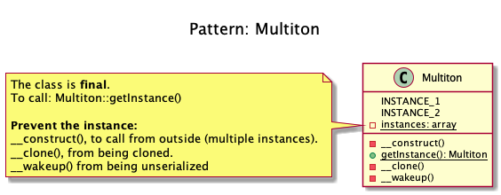

# Multiton

+ It has a list of named instances that are used, **like a singleton but with N instances**.

+ _This is **considered to be an anti-pattern**. For better testability and maintainability **use dependency injection**_.

+ Examples
    + 2 DB Connectors, e.g. one for MySQL, the other for SQLite
    + Multiple Loggers (one for debug messages, one for errors)

## Recipe
+ The same as Singleton but the house the instance is **static array**, not a regular variable.

## Sources
+ [Domnikl](https://github.com/domnikl/DesignPatternsPHP/tree/master/Creational/Multiton)
