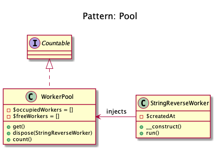

# Pool

+ It uses **a set of initialized objects kept ready to use (A Pool)**, rather than allocating and destroying them on demand. 

+ A client of the pool will **request an object from the pool and perform operations on the returned object**. When the client has finished, **it returns the object, which is a specific type of factory object, to the pool rather than destroying it**.

+ The **pooled object is obtained in predictable time when creation of the new objects** (especially over network) may take variable time.

+ However these **benefits are mostly true for objects that are expensive with respect to time**, such as database connections, socket connections, threads and large graphic objects like fonts or bitmaps. 

_Object pooling can offer a significant performance boost in situations where the cost of initializing a class instance is high, the rate of instantiation of a class is high, and the number of instances in use at any one time is low. In certain situations, simple object pooling (that hold no external resources, but only occupy memory) may not be efficient and could decrease performance._

## Recipe 
+ Create a Pool with 3 methods: get(), dispose() and count() and 2 properties (array) free and occupied.
+ get() creates an object and put it in occupied array.
+ dispose() move from occupied array to free array.
+ If you get() an object after dispose(), the object returned comes from array.
+ spl_object_hash() is used to get the key of the arrays.

## Diagrams
### Dominik Liebler

## Sources
+ [Domnikl](https://github.com/domnikl/DesignPatternsPHP/tree/master/Creational/Pool)
