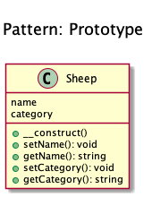
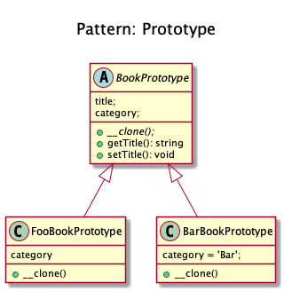

# Prototype

+ Create object based on an existing object through cloning.

+ It avoids the cost of creating objects the standard way (new Foo()) and instead create a prototype and clone it.

+ It creates a copy of an existing object and modify it to your needs, instead of going through the trouble of creating an object from scratch and setting it up.

+ In PHP, it can be easily done using clone keyword and also you could use the magic method __clone to modify the cloning behavior.

+ Remember dolly? The sheep that was cloned! 

+ **Examples**
	+ Large amounts of data (e.g. create 1,000,000 rows in a database at once via a ORM).
  
<!--
## Recipe
+ Create a class 
-->

## Sources
+ [Kamran Ahmed](https://github.com/kamranahmedse/design-patterns-for-humans#-prototype)
+ [Domnikl](https://github.com/domnikl/DesignPatternsPHP/tree/master/Creational/Prototype)
