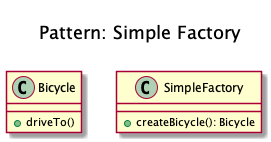
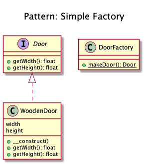

# Simple Factory
 
+ Factory is an object for creating other objects. Technically, a factory is a function or method that returns objects of a varying prototype or class from some method call, which is assumed to be "new".

+ It creates objects like a factory.

+ It simply generates an instance for client without exposing any instantiation logic to the client.

+ You can have multiple factories, differently parameterized, you can subclass it and you can mock it.

+ It always should be preferred over a static factory.

+ **Kamran Ahmed example:**
	+ Consider, you are building a house and you need doors. 
		+ You can either put on your carpenter clothes, bring some wood, glue, nails and all the tools required to build the door and start building it in your house
		+ or you can simply call the factory and get the built door delivered to you so that you don't need to learn anything about the door making
		+ or to deal with the mess that comes with making it.

+ Use it when you need to create an object that is not just a few assignments and involves some logic, it makes sense to put it in a dedicated factory instead of repeating the same code everywhere.

<!-- 
## Recipe
+ Create a class 
-->

## Diagrams
### Dominik Liebler

### Kamran Ahmed

## Sources
+ [Domnikl](https://github.com/domnikl/DesignPatternsPHP/tree/master/Creational/SimpleFactory)
+ [Kamran Ahmed](https://github.com/kamranahmedse/design-patterns-for-humans#-simple-factory)
