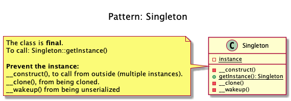

# Singleton

+ To have **only one instance of this object in the application that will
handle all calls**.

+ _There can only be **one president of a country at a time**.  The same president has to be brought to action, whenever duty calls. President here is singleton. In other words, ensures that only one object of a particular class is ever created._

+ _**For creating a Global State**, Singleton **is considered to be an anti-pattern**, for better testability and maintainability, **use Dependency Injection**_.

## Recipe
+ Create a **final class** to prevent to be instaciate. 
+ Create a **private constructor** _to prevent from creating multiple instances_. 
+ Create a **private static variable** _to house the instance_.
+ Create a **static method** _to return the instance_.
+ Disable cloning.
+ Disable serialize. 
+ Disable extension.
+ Get the instance by Singleton::getInstance() 

## Examples
+ DB Connector.
+ Logger _(may also be a Multiton if there are many log files for several purposes)_.
+ Lock file for the application _(there is only one in the filesystem)_.

