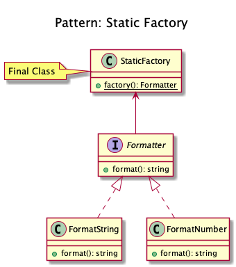

# Static Factory
 
 Similar to the AbstractFactory, this pattern is used to create series of
 related or dependent objects. The difference between this and the
 abstract factory pattern is that the static factory pattern uses just
 one static method to create all types of objects it can create. It is
 usually named ``factory`` or ``build``.
 
<!-- 
 Examples
 -  Zend Framework: ``Zend_Cache_Backend`` or ``_Frontend`` use a factory
    method to create cache backends and frontends
## Recipe
+ Create a class 
-->
 
## Diagrams
### Dominik Liebler

## Sources
+ [Domnikl](https://github.com/domnikl/DesignPatternsPHP/tree/master/Creational/StaticFactory)
