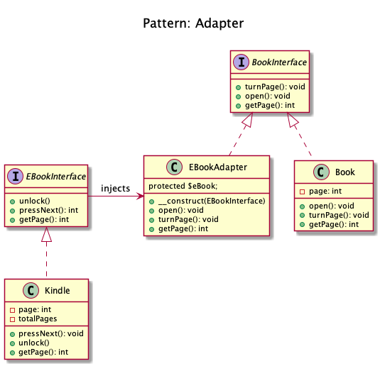
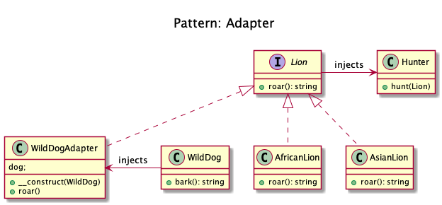

# Adapter/Wrapper

+ It creates a layer to wrap an incompatible object in an adapter to make it compatible with another class without modifying their source code.

+ It allows the interface of an existing class to be used as another interface. 

+ It is often used to make existing classes work with others without modifying their source code.

+ It translates one interface for a class into a compatible interface. 

+ An adapter allows classes to work together that normally could not because of incompatible interfaces by providing its interface to clients while using the original interface.

+ **Examples**
	+ DB Client libraries adapter
	+ Using multiple different webservices and adapters normalize data so that the outcome is the same for all

+ Consider that you have some pictures in your memory card and you need to transfer them to your computer. 
	+ In order to transfer them you need some kind of adapter that is compatible with your computer ports so that you can attach memory card to your computer. 
	+ In this case card reader is an adapter. 
	+ Another example would be the famous power adapter; 
		+ A three legged plug can't be connected to a two pronged outlet, it needs to use a power adapter that makes it compatible with the two pronged outlet. 
	+ Yet another example would be a translator translating words spoken by one person to another.

<!-- 
## Recipe
+ Create a class 
--> 

## Diagrams
### Domnikl

### Kamran Ahmed

## Sources
+ [Domnikl](https://github.com/domnikl/DesignPatternsPHP)
+ [Kamran Ahmed](https://github.com/kamranahmedse/design-patterns-for-humans)
