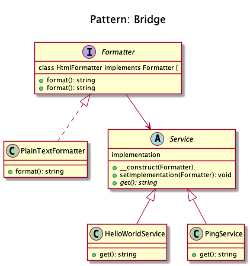
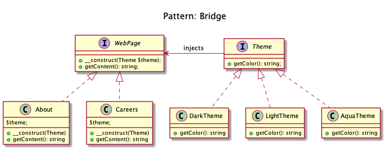

# Bridge

+ Bridge pattern is about preferring composition over inheritance. 

+ The implementation details are pushed to another object with a separate hierarchy.

+ Decouple an abstraction from its implementation so that the two can vary independently.

+ Examples
	+ Symfony
	+ DoctrineBridge <https://github.com/symfony/DoctrineBridge>`__

+ Consider you have a website with different pages and you are supposed to allow the user to change the theme. 
	+ What would you do? 
		+ Create multiple copies of each of the pages for each of the themes or 
		+ Would you just create separate theme and load them based on the user's preferences? 
		+ Bridge pattern allows you to do the second.

<!-- 
## Recipe
+ Create a class 
--> 

## Diagrams
### Domnikl

### Kamran Ahmed

## Sources
+ [Kamran Ahmed](https://github.com/kamranahmedse/design-patterns-for-humans)
+ [Domnikl](https://github.com/domnikl/DesignPatternsPHP)
