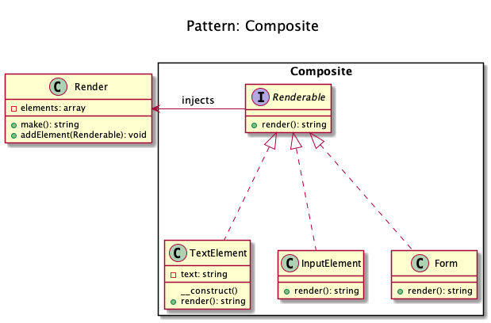
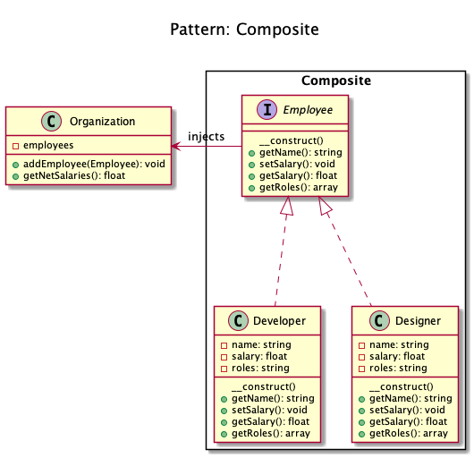

# Composite

+ Composite pattern lets clients **treat the individual objects in a uniform manner**.

+ Every organization is composed of employees. 
	+ **Each of the employees has the same features** (salary, responsibilities, may or may not report to someone or have some subordinates etc...).

+ The **composite node MUST extend the component contract**. This is mandatory for building a tree of components.

+ A **group of objects is to be treated in the same way as a single instance** of an object. 

+ This pattern **compose objects into tree structures to represent part-whole hierarchies**. 

<!-- 
## Recipe
+ Create a class 
--> 

## Diagrams
### Domnikl

### Kamran Ahmed

## Sources
+ [Kamran Ahmed](https://github.com/kamranahmedse/design-patterns-for-humans)
+ [Domnikl](https://github.com/domnikl/DesignPatternsPHP)