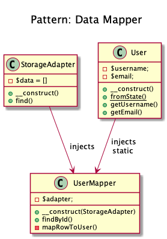

# Data Mapper

+ Is a Data Access Layer that **performs bidirectional transfer of data between a persistent data store** (often a relational database) **and an in memory data representation** (the domain layer). 

+ The goal is to **keep the in memory representation and the persistent data store independent of each other and the data mapper (or Data Access Objects) itself**.
   
_Mapper implementations vary in scope. Generic mappers will handle many different domain entity types, dedicated mappers will handle one or a few._

_The key point of this pattern is, unlike Active Record pattern, the data model follows Single Responsibility Principle._

  
## Examples
+ DB Object Relational Mapper (ORM) : Doctrine2 uses DAO named as "EntityRepository"

## Recipe  
+ Create a Data class with fromState() a static method that return a instance of itself.
+ Create a Mapper that receive a Storage object in constructor.
+ The Mapper returns an object from Data class.

## Diagrams
### Dominik Liebler

## Sources
+ [Domnikl](https://github.com/domnikl/DesignPatternsPHP/tree/master/Structural/DataMapper)
