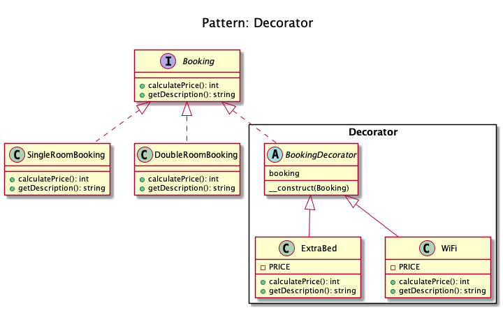
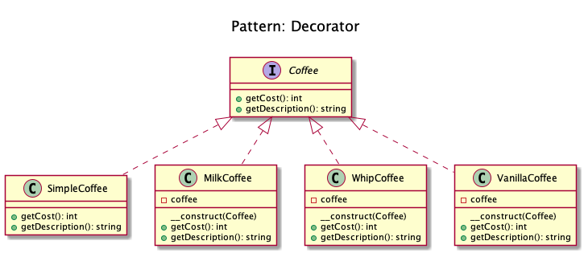

# Decorator

+ It lets you **dynamically change the behavior of an object at run time** by wrapping them in an object of a decorator class.

+ It allows behavior to be added to an individual object, either statically or dynamically,  without affecting the behavior of other objects from the same class.

+ The decorator pattern follows the Single Responsibility Principle, as it allows functionality to be divided between classes with unique areas of concern.

+ Imagine you run a car service shop offering multiple services. 
	+ Now how do you calculate the bill to be charged if you are offering multiple services? 
	+ You pick one service and dynamically keep adding to it the prices for the provided services till you get the final cost.
	+ Here each type of service is a decorator**.

<!-- 
## Recipe
+ Create a class 
--> 

## Diagrams
### Dominik Liebler

### Kamran Ahmed

## Sources
+ [Domnikl](https://github.com/domnikl/DesignPatternsPHP)
+ [Kamran Ahmed](https://github.com/kamranahmedse/design-patterns-for-humans)
+ [Wiki](http://en.wikipedia.org/wiki/Facade_pattern)