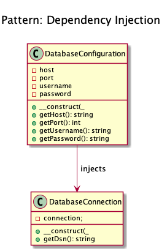

# Dependency Injection

+ It **injects an object inside another object** _(normally via constructor)_, reducing the coupling and the need to extend it.

+ To implement a **loosely coupled architecture** in order to get better testable, maintainable and extendable code.

+ _(DatabaseConfiguration gets injected and DatabaseConnection will get all that it needs from $config)_, **without DI, the configuration would be created directly in DatabaseConnection, which is not very good for testing and extending it**.

+ **Data Source Name (DSN)** provides **connectivity to a database through an ODBC driver**. The DSN contains database name, directory, database driver, UserID, password, and other information. 

+ Examples: 
    +  The Doctrine2 ORM uses dependency injection e.g. for configuration that is injected into a ``Connection`` object. For testing purposes, one can easily create a mock object of the configuration and inject that into the ``Connection`` object
    +  Symfony and Zend Framework 2 already have containers for DI that create objects via a configuration array and inject them where needed (i.e. in Controllers)

## Recipe
+ Create a Configuration class.
+ Create a instance of the Configuration class and inject it in a main class via constructor.

## Diagrams
### Dominik Liebler

## Sources
+ [Domnikl](https://github.com/domnikl/DesignPatternsPHP/tree/master/Structural/DependencyInjection)
