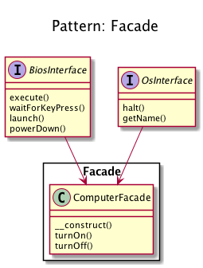
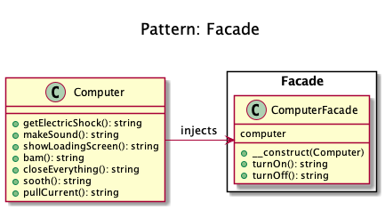

# Facade

+ Facade pattern **provides a simplified interface to a complex subsystem**.

+ "How do you **turn on the computer**?". "Just hit the power button". 
That is what you believe because you are using a simple interface that computer provides on the outside, internally it has to do a lot of stuff to make it happen. 

+ The primary goal of a Facade Pattern is to **reduce coupling of a client and a sub-system** by embedding
many (but sometimes just one) interfaceand follow the Law of Demeter.

+ Its side-effect is reducing the complexity and also to avoid you having to read the manual of a complex API. 

+ A facade does not forbid you the **access to the sub-system**.

+ You can (you should) **have multiple facades for one sub-system**.

+ A good facade **has no ``new``** and a **constructor with interface-type-hinted parameters** in it. If there are multiple creations for each method, it's a Builder or a Factory. If you need creation of new instances, use a Factory as argument.

<!-- 

Real world example

How do you turn on the computer? "Hit the power button" you say! That is what you believe because you are using a simple interface that computer provides on the outside, internally it has to do a lot of stuff to make it happen. This simple interface to the complex subsystem is a facade.

In plain words

Facade pattern provides a simplified interface to a complex subsystem.

Wikipedia says

A facade is an object that provides a simplified interface to a larger body of code, such as a class library.

Programmatic Example

Taking our computer example from above. Here we have the computer class

## Recipe
+ Create a class 
--> 

## Diagrams
### Dominik Liebler

### Kamran Ahmed

## Sources
+ [Kamran Ahmed](https://github.com/kamranahmedse/design-patterns-for-humans)
+ [Domnikl](https://github.com/domnikl/DesignPatternsPHP)
+ [Wiki](http://en.wikipedia.org/wiki/Facade_pattern)