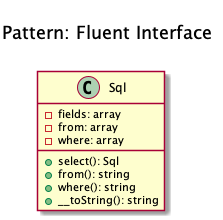

# Fluent Interface

+ To **write code that is easy readable just like sentences in a natural language** _(like English)_.

+ Examples
    + Doctrine2's QueryBuilder works something like that example class below
    + PHPUnit uses fluent interfaces to build mock objects
    + Yii Framework: CDbCommand and CActiveRecord use this pattern, too

## Recipe
+ Create a class where the properties are arrays and every method return the object itself ($this).
+ At this point, the chaining is already implemented.
+ Implement the method __toString() and return the text, joining the elements of the arrays using sprintf().

## Sources
+ [Domnikl](https://github.com/domnikl/DesignPatternsPHP/tree/master/Structural/FluentInterface)
