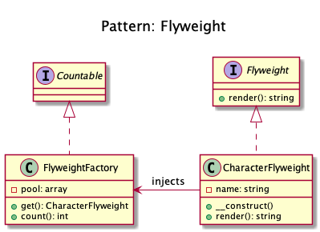
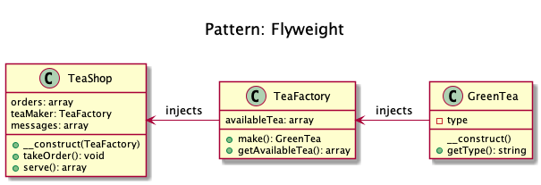

# Flyweight 

+ To minimise memory usage (or computational expenses), a **Flyweight shares as much as possible memory with similar objects**. 

+ It is needed **when a large amount of objects is used that don't differ much in state**.

+ A common practice is to **hold state in external data structures and pass them to the flyweight object when needed**.

+ **A factory manages shared flyweights**. Clients should not instantiate them directly, but let the **factory take care of returning existing objects or creating new ones**.

+ Flyweight pattern **ensures that instances are shared instead of having hundreds of thousands of individual objects** there must be one instance for every char that has been reused for displaying in different fonts.

+ Did you ever have fresh tea from some stall? They often **make more than one cup that you demanded and save the rest for any other customer** so to save the resources e.g. gas etc. **Flyweight pattern is all about that sharing**.

+ First of all we have **tea types** and **tea maker**.
+ **Anything that will be cached is flyweight**, types of tea here will be flyweights.
+ _(in the kamranahmedse example)_ TeaMaker acts as a factory and saves the tea.

## Recipe

<!-- 
## Sources
+ [Kamran Ahmed](https://github.com/kamranahmedse/design-patterns-for-humans)
+ [Domnikl](https://github.com/domnikl/DesignPatternsPHP)
-->