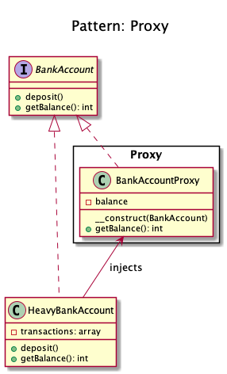
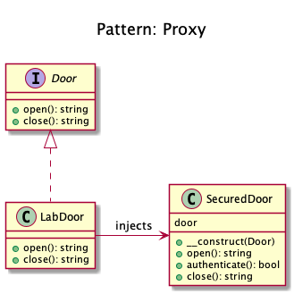

# Proxy

## The Heavy Job
+ It **avoids the instance to execute again the heavy job, already executed by the parent.**

+ **A class functioning as an interface to something else, represents the functionality of another class**.

+ A proxy is a **wrapper or agent object** that is being called by the client to **access the real serving object behind the scenes**. 

## Security
+ Have you ever used an access card to go through a door? 
	+ It can be opened either using access card or by pressing a button that bypasses the security. 
	+ The door's main functionality is to open but there is a proxy added on top of it to add some functionality. 

## Examples
+ Doctrine2 uses proxies to implement framework magic (e.g. lazy initialization) in them, while the user still works with his own entity classes and will never use nor touch the proxies.

Firstly we have the door interface and an implementation of door
Then we have a proxy to secure any doors that we want
And here is how it can be used
Yet another example would be some sort of data-mapper implementation. For example, I recently made an ODM (Object Data Mapper) for MongoDB using this pattern where I wrote a proxy around mongo classes while utilizing the magic method __call(). All the method calls were proxied to the original mongo class and result retrieved was returned as it is but in case of find or findOne data was mapped to the required class objects and the object was returned instead of Cursor.

## Recipe 
+ Create a class to do the heavy job/security door _(may implement an interface)_.
+ Create a class (Proxy) to behave like a layer for Heavy Job/Security class.
+ The Proxy has the same method as Heavy Job/Security class and depends on a condition, the Proxy return the current value or to run the parent's method (injected).

## Diagrams
### Domnikl

### Kamran Ahmed

 
## Sources
+ [Domnikl](https://github.com/domnikl/DesignPatternsPHP/tree/master/Structural/Proxy)
+ [Kamran Ahmed](https://github.com/kamranahmedse/design-patterns-for-humans#-proxy)
