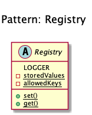

# Registry

+ It implements a **central storage for objects often used throughout the application**. 

+ It is typically implemented using an **abstract class with only static methods** (or using the Singleton pattern). 

+ This introduces **global state, which should be avoided at all times**. Instead implement it using **Dependency Injection**.

## Recipe
+ Create an abstract class with 2 static properties (allowedKeys and storedValues).
+ Create 2 static methods (Set and Get) to manage the $storedValues properties. 

## Sources
+ [Domnikl](https://github.com/domnikl/DesignPatternsPHP)
